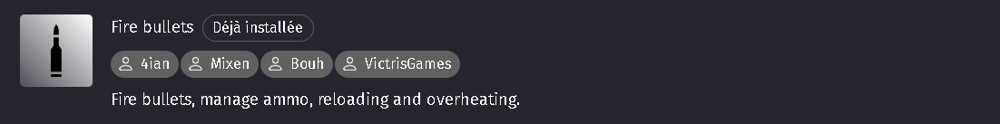
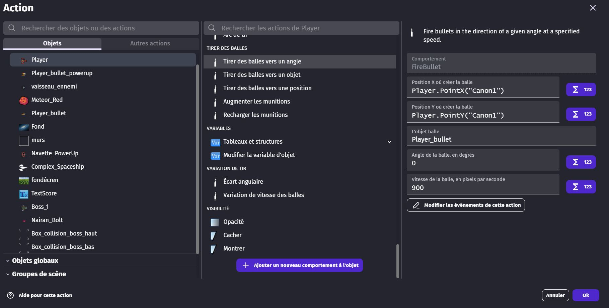
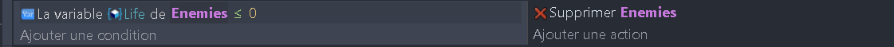
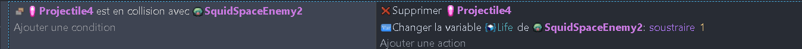

# Programmation du vaisseau du joueur 🚀

## Comportement du vaisseau

Maintenant que tu as créé les objets de ton jeu, il est temps de programmer leur comportement. Commençons par le vaisseau du joueur. Tu vas voir, c'est super simple !

Clique sur le vaisseau dans la scène pour le sélectionner. Une fenêtre s'ouvre, clique sur l'onglet "Comportements". Clique ensuite sur le bouton "Ajouter un comportement" et choisis "Mouvement vu du dessus". Cela va ajouter un comportement au vaisseau qui va lui permettre de se déplacer avec les flèches du clavier.

Super, maintenant le vaisseau peut se déplacer. 

Si ton vaisseau 'tourne' quand tu te déplace, c'est qu'il faut **décocher la case "tourner l'objet"** dans le comportement.

## Tirer des balles

### Mise en Place

Pour permettre au vaisseau du joueur de tirer des balles, nous allons devoir ajouter le comportement **Fire Bullet** (ou **Tirer des balles**).

On souhaite que notre vaisseau puisse tirer avec deux canons en même temps.

Pour tirer depuis les deux canons du vaisseau : 
 - Ouvre les paramètres de ton vaisseau (double-clique dessus)
 - Va dans **Modifier les Points**
 - Ajoute deux points, que tu positionne où tu le souhaite, et nomme "Canon1" et "Canon2"

Voilà, le vaisseau peut se déplacer et est prêt à tirer des projectiles.

### Programmation

Dans les [évènements](https://github.com/g404-code-gaming/GDevelop_Cour/blob/main/%C3%A9v%C3%A8nements.md) de la scène. Nous allons ajouter une condition qui va permettre au vaisseau de tirer des projectiles.

Voici le résultat que vous devez obtenir (des explications sont fournies plus bas)

Ajoutez donc un nouvel évènement. 

Dans cet évènement, ajouter une condition : *Quand la touche Espace est pressée*
Pour trouver cette condition, chercher "Touche pressée", et choisissez la touche "Espace".

Pour l'action de tir avec un canon, voici une aide pour remplir les paramètres : 

Super, le vaisseau peut maintenant tirer des projectiles. Mais il ne peut pas encore détruire les ennemis. Allons programmer le comportement des ennemis.

# Programmation des ennemis 👾

## Comportement des ennemis

**_Tu peux importer plusieurs type d'ennemis sur ta scène, et les réunir dans un groupe d'objets pour leur appliquer le même code_**

Pour l'instant, nous allons juste dire que si un ennemi a ses points de vie à zéro, il est supprimé.

Ajoute une condition qui vérifie si la variable "health" de l'ennemi est inférieure ou égale à 0. Si c'est le cas, ajoute une action qui supprime l'ennemi.

## Programmation des collisions

Maintenant, nous allons programmer les collisions entre les projectiles et les ennemis. Ajoute une condition qui vérifie si un projectile est en collision avec un ennemi. Si c'est le cas, ajoute une action qui soustrait 1 à la variable "health" de l'ennemi et supprime le projectile.

Super, les ennemis peuvent maintenant être détruits. Mais ils ne peuvent pas encore détruire le vaisseau. Ajoutons ce comportement au vaisseau.

__________

Il suffit d'ajouter une condition qui vérifie si le vaisseau est en collision avec un ennemi. Si c'est le cas, ajoute une action qui supprime le vaisseau.

Voilà, la base est posée. Tu peux maintenant jouer à ton jeu et voir ce que ça donne. Mais il reste encore beaucoup de choses à faire. Alors, prêt à continuer ? Allez, c'est parti ! Suis ce lien pour passer à la suite : [Ajout de la progression et de la difficulté](04_progression_difficulte.md) 🎉
