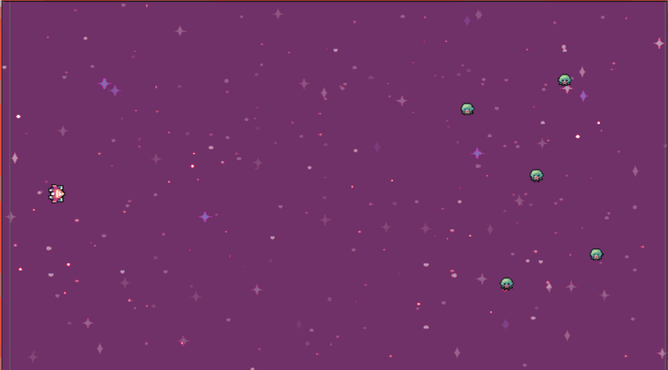
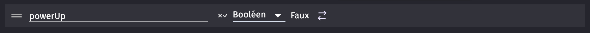

# Création des objets du jeu 🎮7

Maintenant que tu as GDevelop 5 prêt et configuré, il est temps de passer à la partie amusante : la création des objets de ton jeu ! Dans notre jeu Space Shooter, nous allons avoir besoin de plusieurs types d'objets : le vaisseau du joueur, les projectiles, les ennemis, les météores et les power-ups. 
On va utiliser des super assets de "Space Shooter by Pixel Boy" pour tous ces objets. Allez, c'est parti !

1. **Importation des objets** :
  
Pour importer les objets, suis ce petit cours qui va t'expliquer tout ce dont tu as besoin : --> [Objets]()

Voici les objets que tu dois positionner dans ta scène :

  - **Spaceship** : le vaisseau du joueur, qui va se déplacer et tirer des projectiles.

  - **Background** : un fond d'écran, pour rendre la scène plus vivante *(astuce, cherche Space)*

  - **Meteor** : des météores ou astéroïdes qui vont arriver vers le joueur à toute vitesse et le détruire en cas d'impact.

  - **Ennemy** : des aliens, vaisseaux ou tout autre forme de menace qui vont se diriger vers notre vaisseau pour le détruire.

  - **Projectiles** : le vaisseau du joueur va tirer des projectiles pour attaquer les différentes menances (astuce : cherche Ball ou Laser pour trouver des projectiles futuristes)

  - **Power-Up** : Un objet qui va renforcer le joueur lorsqu'il le touche. 

Super, tu as positionné tous les objets de ta scène. Mais il reste encore quelques réglages à faire.

3. **Création des variables d'objets** :

Pour savoir comment créer des variables, consulte cette partie de cours --> [Variables](https://github.com/g404-code-gaming/GDevelop_Cour/blob/main/Variables.md)

**Life** : Cette variable de type Nombre est à appliquer à notre **ennemi**. Cette variable va nous permettre de savoir combien de points de vie il reste à l'ennemi. Règle la valeur de cette variable comme tu le souhaite. 💔

**powerUp** : Cette variable de type booléen est à appliquer à notre _Space Ship_. Cette variable va nous permettre plus tard de savoir si notre vaisseau a son power up activé ou non. 🛸

Et voilà, tu as de quoi commencer à jouer ! N'est-ce pas génial de voir ton jeu prendre forme ? Mais ne t'arrête pas là, il reste encore beaucoup à faire. Alors, prêt à programmer le comportement de ces objets ? Allez, c'est parti ! Direction [la prochaine partie](03_programmation_comportements.md) ! 🎉
