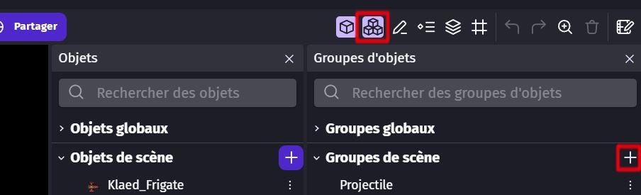
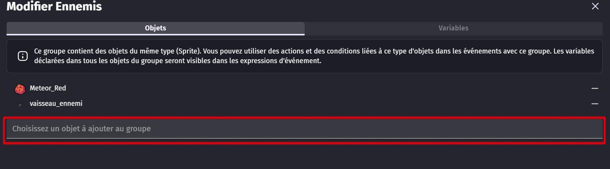
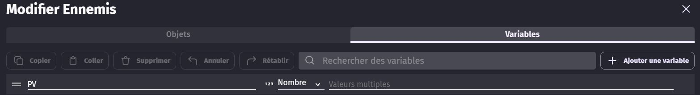
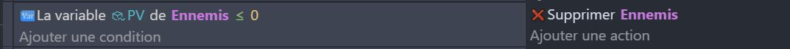
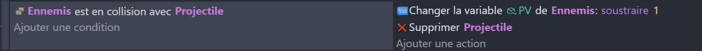
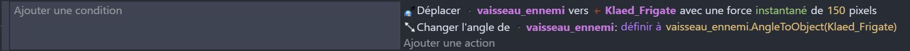
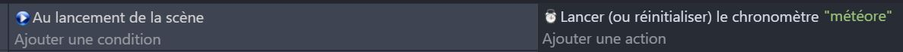
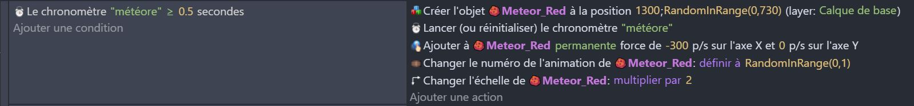
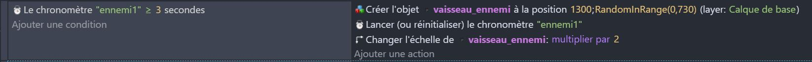

# 3 Programmation des dangers

Dans le jeu, il y aura deux types principaux de danger : 

   - Les météores, qui avancent en ligne droite.
   - Les vaisseaux ennemis (ou aliens), qui se dirigent vers le joueur.

Pour réduire la quantité de code nécessaire, nous allons réunir tout les éléments dangereux dans un groupe : 

 

Dans le groupe, choisissez les objets que vous voulez rendre 'dangereux' : ceux qui vont détruire le vaisseau du joueur au contact et être détruit par les tirs du joueur.

Dans le groupe d'ennemis, créez la variable PV pour que les ennemis puissent être détruits. 

Une fois fait, allez dans les variables de **Chaque ennemis** et définissez les PV que vous souhaitez leurs mettres (1, 5, 10, .... c'est au choix !).

## Programmation des ennemis 👾

Pour l'instant, nous allons juste dire que si un ennemi a ses points de vie à zéro, il est supprimé.

Ajoute une condition qui vérifie si la variable "PV" de l'ennemi est inférieure ou égale à 0. Si c'est le cas, ajoute une action qui supprime l'ennemi.

## Programmation des collisions

Maintenant, nous allons programmer les collisions entre les projectiles et les ennemis. Ajoute une condition qui vérifie si un projectile est en collision avec un ennemi. Si c'est le cas, ajoute une action qui soustrait 1 à la variable "PV" de l'ennemi et supprime le projectile.

Super, les ennemis peuvent maintenant être détruits. Mais ils ne peuvent pas encore détruire le vaisseau. Ajoutons ce comportement au vaisseau.

---

## Déplacement des ennemis

Nous allons programmer le déplacement des ennemis.

Maintenant, on va simplement ajouter une action de déplacement vers le vaisseau. Ajoute une action qui déplace l'ennemi vers le vaisseau avec une vitesse de ton choix.

## Apparition des météores

On va corser un peu les choses en ajoutant des météores qui vont venir de la droite de l'écran. Nous allons utiliser un outil plus complexe qu'une simple condition cette fois. Nous allons utiliser les **Chronomètres** ! 

En effet, on souhaite que les Météores apparaissent tout le temps à intervalle régulier. Un chronomètre permettra de compter le temps et faire apparaître périodiquement des météores.

Commencez par créer un évènement qui initie le chronomètre au lancement de la scène

Ensuite, il faut programmer l'apparition des Météores : 

(1) Ils apparaissent lorsque la valeur du chronomètre dépasse 0.5 seconde. 
(2) Cela crée un météore à une position aléatoire sur la droite de l'écran 
(3) Le météore est ensuite déplacée vers la gauche à l'aide d'une force. 
(4) Pour être certain que le météore ait la bonne taille, ont l'aggrandie. 

Tester votre programme pour voir si les météores apparaissent correctement et se déplacent vers la gauche. 

---

Une fois que les météores sont terminés, vous pouvez **refaire le même programme pour les ennemis** : ces derniers apparaissent de la même manière. 

- **Initialisez** un Chronomètre "ennemis" au lancement de la scène.
  
- **Ajouter** un évènement qui fait apparaîter les ennemis lorsque le chronomètre atteint une certaine valeur (résultat attendue ci-dessous).

---

Avec tout ça, nous avons des ennemis qui se déplacent et peuvent être détruit par les attaques du joueur. 

Il nous faut encore ajouter la mort du vaisseau du joueur et d'autres détails importants pour rendre le jeu plus amusant :

C'est partis pour la suite : [Polissage et finalisation](04_polissage.md) 🎉
