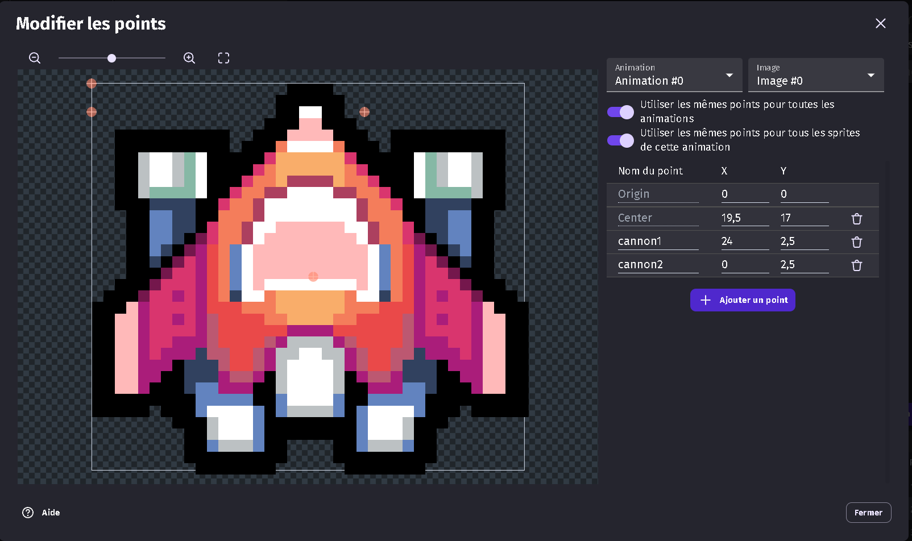

# Programmation du vaisseau du joueur 🚀

## Comportement du vaisseau

Maintenant que tu as créé les objets de ton jeu, il est temps de programmer leur comportement. Commençons par le vaisseau du joueur. Tu vas voir, c'est super simple !

Clique sur le vaisseau dans la scène pour le sélectionner. Une fenêtre s'ouvre, clique sur l'onglet "Comportements". Clique ensuite sur le bouton "Ajouter un comportement" et choisis "Mouvement vu du dessus". Cela va ajouter un comportement au vaisseau qui va lui permettre de se déplacer avec les flèches du clavier.

Super, maintenant le vaisseau peut se déplacer. Mais il ne peut pas tirer. Pour cela, nous allons devoir ajouter un autre comportement. Clique sur le bouton "Ajouter un comportement" et va sur l'onglet "Rechercher de nouveaux comportements". Dans la barre de recherche, choisis fire bullets et importe le dans ton projet.

Pour tirer depuis les deux canons du vaisseau, il faut ajouter des "points" sur l'image du vaisseau. Double-clique sur l'image du vaisseau dans la scène pour l'ouvrir dans l'éditeur d'images. Clique sur le bouton "Modifier les points" et ajoute deux points sur les canons du vaisseau. Nomme ces points "canon1" et "canon2".

Voilà, le vaisseau peut se déplacer et est prêt à tirer des projectiles.

## Programmation des projectiles

Allons dans l'onglet des événements de la scène. Nous allons ajouter une condition qui va permettre au vaisseau de tirer des projectiles.

Clique sur le bouton "Ajouter une condition", va dans l'onglet "autres conditions" et cherche "Touche pressée". Dans la liste déroulante à droite, choisis "Space". Cela va ajouter une condition qui va vérifier si la touche espace est appuyée.

Maintenant, ajoutons une action qui va permettre au vaisseau de tirer. Clique sur le bouton "Ajouter une action" et choisis "Fire bullets in the direction of a given angle". Et configure le comme sur cette image :

Fais la même chose pour le deuxième canon et changeons l'angle du projectile pour que l'image soit orientée vers la droite.

Super, le vaisseau peut maintenant tirer des projectiles. Mais il ne peut pas encore détruire les ennemis. Allons programmer le comportement des ennemis.

# Programmation des ennemis 👾

## Comportement des ennemis

**_Tu peux importer plusieurs type d'ennemis sur ta scène, et les réunir dans un groupe d'objets pour leur appliquer le même code_**

Pour l'instant, nous allons juste dire que si un ennemi a ses points de vie à zéro, il est supprimé.

Ajoute une condition qui vérifie si la variable "health" de l'ennemi est inférieure ou égale à 0. Si c'est le cas, ajoute une action qui supprime l'ennemi.

## Programmation des collisions

Maintenant, nous allons programmer les collisions entre les projectiles et les ennemis. Ajoute une condition qui vérifie si un projectile est en collision avec un ennemi. Si c'est le cas, ajoute une action qui soustrait 1 à la variable "health" de l'ennemi et supprime le projectile.

Super, les ennemis peuvent maintenant être détruits. Mais ils ne peuvent pas encore détruire le vaisseau. Ajoutons ce comportement au vaisseau.

Il suffit d'ajouter une condition qui vérifie si le vaisseau est en collision avec un ennemi. Si c'est le cas, ajoute une action qui supprime le vaisseau.

## Déplacement des ennemis

Une dernière chose pour clore ce chapitre. Nous allons programmer le déplacement des ennemis. Ajoute un comportement "Recherche de chemin" aux ennemis.

Maintenant, on va simplement ajouter une action de déplacement vers le vaisseau. Ajoute une action qui déplace l'ennemi vers le vaisseau avec une vitesse de 100.

Voilà, la base est posée. Tu peux maintenant jouer à ton jeu et voir ce que ça donne. Mais il reste encore beaucoup de choses à faire. Alors, prêt à continuer ? Allez, c'est parti ! Suis ce lien pour passer à la suite : [Ajout de la progression et de la difficulté](04_progression_difficulte.md) 🎉
