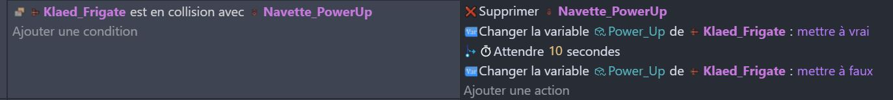
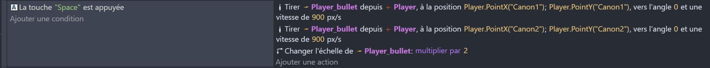
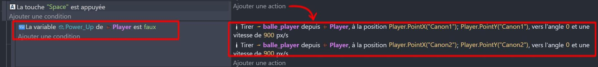
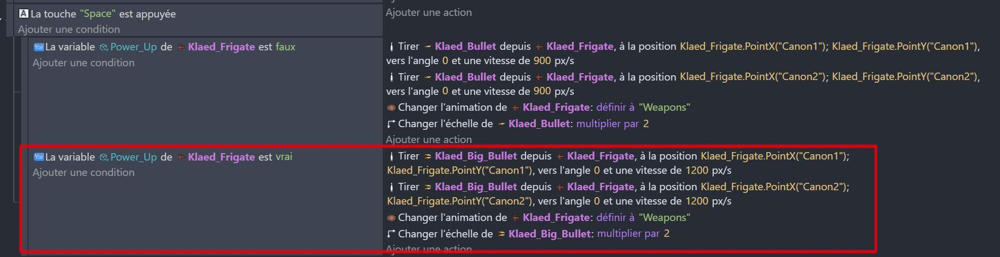
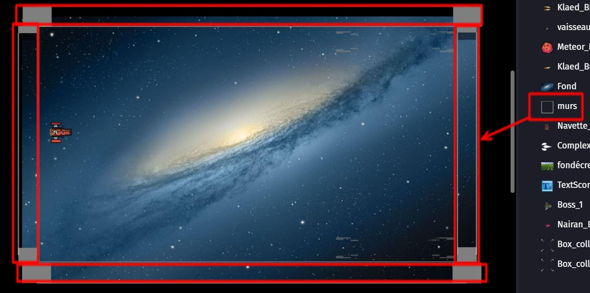
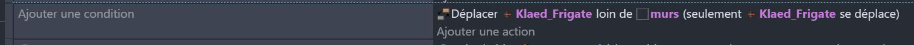
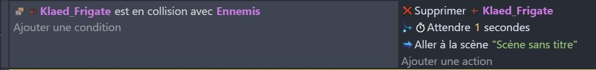

## Polissage et finitions 🎨

## Ajout des power-ups

Nous allons donner la possibilité au joueur de récupérer des power-ups qui vont lui donner des bonus. Nous allons utiliser la variable "powerUp" du vaisseau.

 1. Ajoute une condition qui vérifie si le vaisseau du joueur est en collision avec un power-up. Si c'est le cas, ajoute une action qui supprime le power-up et qui met la variable "powerUp" du vaisseau du joueur à true. Au bout de 10 secondes, ajoute une action qui met la variable "powerUp" du vaisseau du joueur à false.

 3. Il va falloir modifier le comportement du vaisseau du joueur pour qu'il tire des projectiles plus puissants quand il a un power-up.

Avant, le programme de tire ressemblait à ça : 

Modifie-le pour qu'il inclue la condition de la variable 'power-Up' dans un sous-évènement : 

Ajoute maintenant un nouveau sous-évènement pour que le vaisseau tire de nouveaux projectiles si la variable Power-Up est vraie. 

Les projectiles améliorés doivent être programmés de la même manière que les projectiles normaux (voir chapitre précédent). 

 4. Enfin, nous allons conditionner l'apparition des power-ups.
   Ils apparaissent de la même manière que les météores : reproduire le code des météores, mais appliqué aux Power-Up. 

Voilà, tu as fini cette partie ! N'hésite pas à tester ton jeu pour voir si tout fonctionne correctement. Si tu as des erreurs, n'hésite pas à comparer ton code avec celui de la solution. Tu peux ajouter un power-up dans la scène pour le prendre immédiatement pendant tes tests et vérifier que tout fonctionne correctement.

---

## Bordures de l'écran 

Pour le moment, notre vaisseau peut sortir de l'écran, ce n'est pas prévus pour le jeu. 

Nous allons donc ajouter des murs qui bloquent les bords de l'écran pour 'coincer' le vaisseau dans la partie ! 

Ajoutez un objet **Mur** (qui peut être n'importe quel carré) et placez-les de manières à ce qu'ils soient en dehors de la caméra. 

Ajoutez ensuite l'évènement pour empécher le vaisseau du joueur de traverser les murs : il s'agit d'une action "Séparer" qui sépare deux objets. 

Avec cette nouvelle modification, votre vaisseau est désormais correctement enfermé dans l'écran et ne pourra plus se perdre au delà de la vue de la caméra.

# Game Over 🎮

Nous allons désormais programmer la collision avec les ennemis et la mort du personnage. 

C'est plutôt simple, en fait ! Il suffit de **supprimer** le vaisseau du joueur en cas de **collision** avec un Ennemi, puis de **relancer la scène** avec l'action "Changer la scène".

Avce cet ajout, ton personnage est désormais détruit par les ennemis, et le jeu se relance tout seul.

---

Bravo ! Tu as presque fini le projet ! 

Enfin... non ! 
Il reste encore beaucoup de chose à faire pour que le jeu soit complet, mais tu as une bonne base pour créer des jeu GDevelops. 

Je te laisse explorer par toi-même pour ajouter des fonctionnalités comme un score, des vies, des niveaux, des boss, etc...

Tu peux essayer dès maintenant d'ajouter ces fonctionnalités à ton jeu.

La suite ici : [Ajout de score](05_score.md) 🎉
