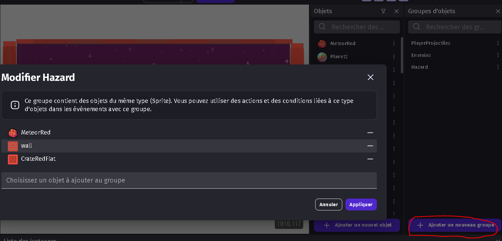
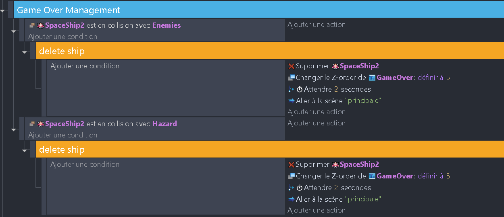

## Polissage et finitions 🎨

## Ajout des power-ups

Nous allons donner la possibilité au joueur de récupérer des power-ups qui vont lui donner des bonus. Nous allons utiliser la variable "powerUp" du vaisseau.

1. Ajoute une condition qui vérifie si le vaisseau du joueur est en collision avec un power-up. Si c'est le cas, ajoute une action qui supprime le power-up et qui met la variable "powerUp" du vaisseau du joueur à true. Au bout de 10 secondes, ajoute une action qui met la variable "powerUp" du vaisseau du joueur à false.

3. Il va falloir modifier le comportement du vaisseau du joueur pour qu'il tire des projectiles plus puissants quand il a un power-up. Ajoute une condition qui vérifie si la variable "powerUp" du vaisseau du joueur est true. Si c'est le cas, ajoute une action qui tire des projectiles différents.

Les projectiles améliorés doivent être programmés de la même manière que les projectiles normaux (voir chapitre précédent). 

5. Enfin, nous allons conditionner l'apparition des power-ups.
   Ils apparaissent de la même manière que les météores : reproduire le code des météores, mais appliqué aux Power-Up. 

Voilà, tu as fini cette partie ! N'hésite pas à tester ton jeu pour voir si tout fonctionne correctement. Si tu as des erreurs, n'hésite pas à comparer ton code avec celui de la solution. Tu peux ajouter un power-up dans la scène pour le prendre immédiatement pendant tes tests et vérifier que tout fonctionne correctement.

---

# Game Over 🎮

Je te propose de regrouper certains éléments dans des groupes d'objets comme ceci par exemple :

Nous allons commencer par ajouter un écran de Game Over. Pour cela, nous allons créer un groupe qui va contenir tous les événements qui gèrent le Game Over. Nous allons ensuite ajouter une condition qui vérifie si le vaisseau du joueur est en collision avec un ennemi ou un météore. Si c'est le cas, nous allons afficher un texte "Game Over".

Ajoute des murs autour de la scène. Ajoute une condition qui vérifie si le vaisseau du joueur est en collision avec un mur. Si c'est le cas, ajoute une action qui supprime le vaisseau du joueur.

Ajoute dans la scène un objet "Texte" et positionne-le au centre de la scène et mets-le avec un index -1. Ajoute une condition qui vérifie si le vaisseau du joueur est en collision avec un ennemi ou un hazard (le groupe que nous venons de faire). Si c'est le cas, ajoute une action qui affiche le texte "Game Over" et qui met le texte index 2.

Au bout de 2 secondes, ajoute une action qui change la scène pour la scène "principale", ce qui relancera le jeu.

Voici le résultat que tu devrais obtenir :

Bravo ! Tu as fini ce projet ! Du moins la première partie car il reste tant de choses à faire pour rendre ce jeu plus intéressant. Je te laisse explorer par toi-même pour ajouter des fonctionnalités comme un score, des vies, des niveaux, des boss, etc...
Il faut aussi des sons et de la musique pour rendre le jeu plus vivant. Tu peux utiliser des sons et de la musique de ce site : https://freesound.org/
Et enfin quelques effets visuels comme des explosions, des particules, etc...

Tu peux essayer dès maintenant d'ajouter ces fonctionnalités à ton jeu. Mais nous allons avant tout ça voir comment publier ton jeu pour que tu puisses le partager avec tes amis ! C'est parti !

La suite ici : [Ajout de score](06_score.md) 🎉
