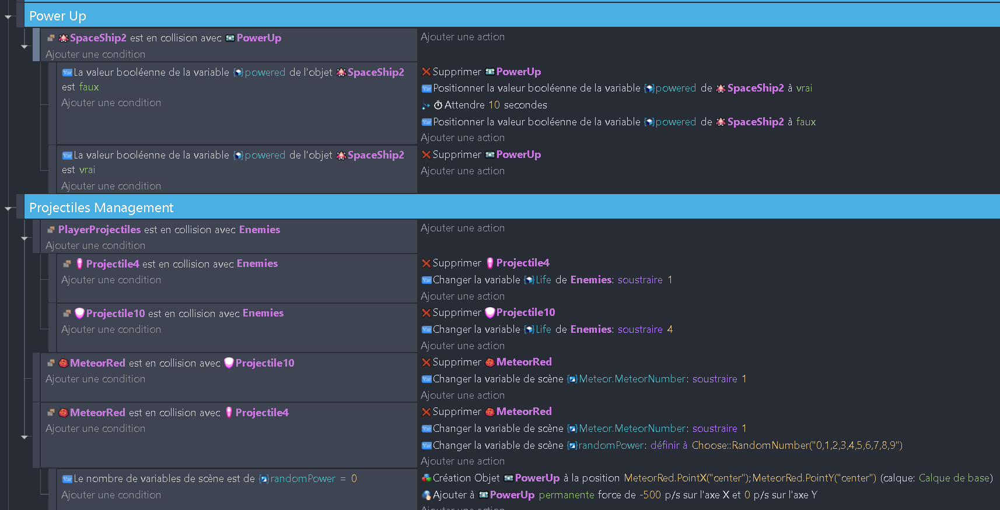

# Ajout des météores et des power-ups 🌠

## Ajout des météores

On va corser un peu les choses en ajoutant des météores qui vont venir de la droite de l'écran. Nous allons utiliser un outil plus complexe qu'une simple condition cette fois. Nous allons utiliser les **Chronomètres** ! 

En effet, on souhaite que les Météores apparaissent tout le temps à intervalle régulier. Un chronomètre permettra de compter le temps et faire apparaître périodiquement des météores.

Commencez par créer un évènement qui initie le chronomètre au lancement de la scène

Ensuite, il faut programmer l'apparition des Météores : 

(1) Ils apparaissent lorsque la valeur du chronomètre dépasse 0.5 seconde. 
(2) Cela crée un météore à une position aléatoire sur la droite de l'écran 
(3) Le météore est ensuite déplacée vers la gauche à l'aide d'une force. 
(4) Pour être certain que le météore ait la bonne taille, ont l'aggrandie. 

## Ajout des power-ups

Nous allons donner la possibilité au joueur de récupérer des power-ups qui vont lui donner des bonus. Nous allons utiliser la variable "powerUp" du vaisseau.

1. Ajoute une condition qui vérifie si le vaisseau du joueur est en collision avec un power-up. Si c'est le cas, ajoute une action qui supprime le power-up et qui met la variable "powerUp" du vaisseau du joueur à true. Au bout de 10 secondes, ajoute une action qui met la variable "powerUp" du vaisseau du joueur à false.

3. Il va falloir modifier le comportement du vaisseau du joueur pour qu'il tire des projectiles plus puissants quand il a un power-up. Ajoute une condition qui vérifie si la variable "powerUp" du vaisseau du joueur est true. Si c'est le cas, ajoute une action qui tire des projectiles différents.

Les projectiles améliorés doivent être programmés de la même manière que les projectiles normaux (voir chapitre précédent). 

5. Enfin, nous allons conditionner l'apparition des power-ups. Quand un météore est détruit avec le "projectile4", change la valeur d'une variable "randomPower" avec une valeur aléatoire entre 0 et 9. Ensuite ajoute une condition qui vérifie si la variable "randomPower" est égale à 0. Si c'est le cas, ajoute une action qui crée un objet "powerUp" à la position du météore détruit et applique une force de -500 sur l'axe X pour qu'il fonce tout droit !

Voici le résultat que tu devrais obtenir :
[Uploading Choose.json…]()

Voilà, tu as fini cette partie ! N'hésite pas à tester ton jeu pour voir si tout fonctionne correctement. Si tu as des erreurs, n'hésite pas à comparer ton code avec celui de la solution. Tu peux ajouter un power-up dans la scène pour le prendre immédiatement pendant tes tests et vérifier que tout fonctionne correctement.

La fin ici : [Polissage et finalisation](05_polissage_finalisation.md) 🎉
