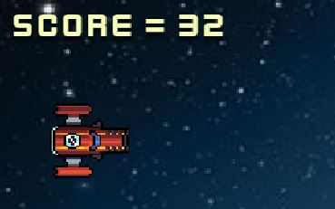
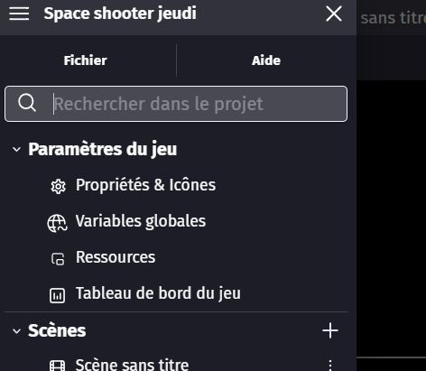
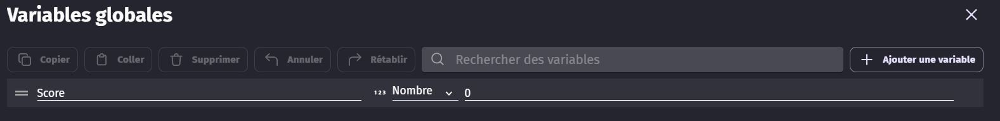
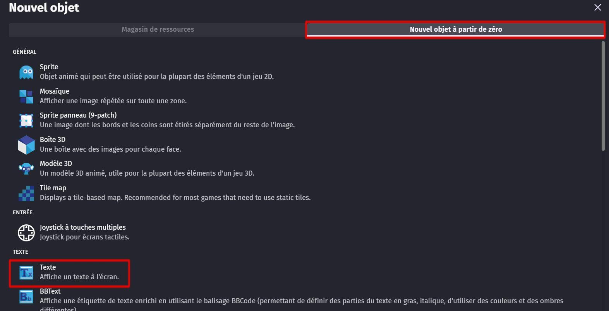
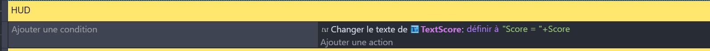
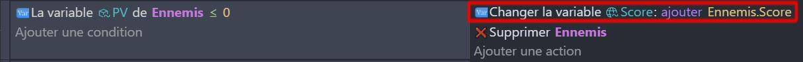
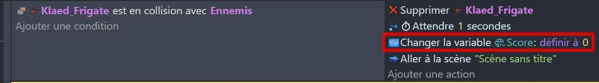
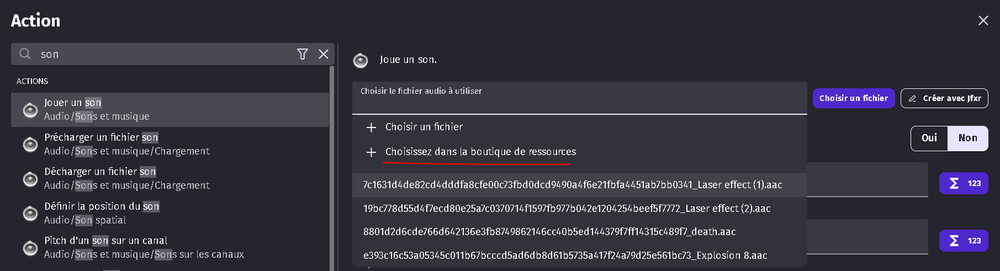

# Ajout de score et de son 🎵🔢

## Ajout de score 🔢

Comme tout bon space shooter qui se respecte, il nous faut un compteur de score ! 🚀

Pour cela, nous allons utiliser une variable globale que nous allons nommer "Score". 

Nous l'incrémenterons chaque fois que le vaisseau du joueur détruit un ennemi ou un météore. 🌠

Il nous faut aussi placer un nouvel objet de texte sur la scène : **TextScore**.

Pour que le texte sur la scène affiche correctement la valeur de la variable, il faut créer un nouvel évènement : 

Le Joueur gagne des points lorsqu'il détruit des ennemis, c'est-à-dire des aliens/vaisseaux ou des météores : Modifiez le programme pour qu'il utilise la variable Score des ennemis. 

Les variables globales ont une caractéristique : elles conservent leur valeur même lorsqu'on change de scène. Cela signifie que, si le joueur perd la partie et relance la scène, son score reste le même. 
Pour éviter cela, on remet le score à 0 en cas de mort du personnage : 

## Ajout de son 🎵

Si tu as remarqué, notre jeu est actuellement sans son. Un jeu sans son est un peu triste. 😔 Alors, nous allons ajouter des sons pour rendre notre jeu plus vivant. 🎉

Sur les captures d'écran ci-dessus, tu as pu voir comment j'ai ajouté un son lorsqu'un ennemi est détruit. Je vais te montrer comment j'ai fait. 🎧

Ajoute une action pour jouer un son à la suite de l'action qui détruit l'objet. Tu peux choisir un son dans la bibliothèque de GDevelop ou ajouter un son que tu as téléchargé sur internet. 🌐

Maintenant, c'est à toi de jouer ! Ajoute des sons pour les autres événements de ton jeu. 🎶

- Quand le vaisseau du joueur est détruit
- Quand un météore est détruit
- Quand le joueur tire

## La suite ! 🚀

Ton jeu commence à être intéressant, mais il manque encore quelques fonctionnalités pour le rendre plus captivant. Il faut une fin à ce premier niveau ! 🏁
Je te propose de rajouter un boss à la fin du niveau. Ce boss sera plus gros et plus résistant que les autres ennemis. Il faudra donc lui tirer dessus de nombreuses fois pour le détruire. 🤖

allez, c'est parti ! [Boss Maman Pieuvre](06_Boss_Pieuvre.md)
