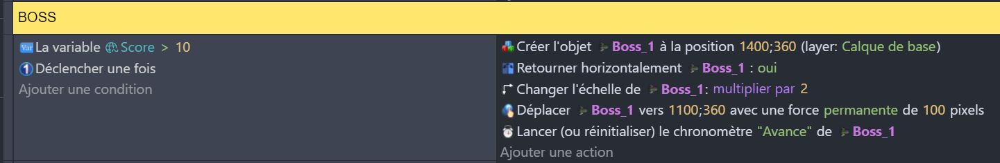
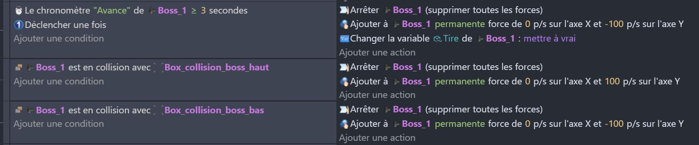
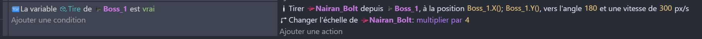
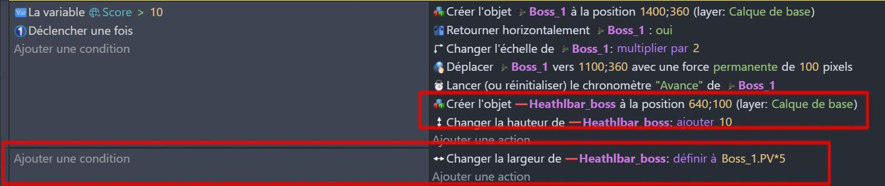

# Boss fin de niveau 🐙🎮

Tout Space Shooter qui se respecte possède un ou plusieurs **Boss* : des ennemis plus dangereux que les autres qui vont proposer un défi de taille au joueur. 

Pour terminer le jeu, nous allons ajouter un nouvel objet Boss à notre jeu. 

N'oubliez pas de l'ajouter au groupe **Ennemis** pour qu'il subisse des dégâts et blesse le joueur au contact. 

## Apparition du boss

Le Boss apparait lorsque la valeur de score du joueur atteint une certaine valeur. 
Après son apparition, il avance quelques secondes, puis entame un déplaçant de combat en alternant une montée et une descente. 

Ajoutez le programme pour que le Boss apparaisse : 
Il vous faudra ajuster les coordonnées pour qu'il apparaisse exactement là où vous le souhaitez et ce déplace ni trop vite, ni trop lentement. 

## Déplacement du boss

Comme dit plus haut, le Boss possède un déplacent de haut en bas. 

Pour qu'il puisse réaliser facilement un tel mouvement, nous allons faire 'rebondir' le Boss sur des murs invisibles. 

Créez les objets **Box_collision_boss_haut** et **Box_collision_boss_bas** et placez-les sur la scène pour qu'ils se trouvent en haut et en bas de la position du Boss.

Dans le programme, ajoutez les évènements de déplacement du Boss :

## Tir du boss

Le boss va tirer des projectiles vers le joueur. Pour cela, nous allons ajouter le [comportement](https://github.com/g404-code-gaming/GDevelop_Cour/blob/main/Comportement.md) **fireBullet** à l'objet Boss. Modifier les paramètres de tir comme vous le souhaitez.

N'oublie pas de bien diriger le projectile vers le joueur et de faire en sorte qu'un projectile détruit le vaisseau du joueur. 💥

Pour ce faire, vous pouvez ajouter les projectiles à la liste des ennemis (le joueur pourra détruire les projectiles en les attaquants), **ou** créer un tout autre évènement qui blesse le joueur lorsqu'il entre en collision avec les projectiles. 

## Barre de vie

Le Boss ayant beaucoup de point de vie, il est important que le joueur puisse voir la **Barre de vie** du Boss. 

Ajoutez un objet **Barre de vie** (ou Healthbar) dans votre jeu. Il s'agit concrètement d'une barre rouge.💔

HealthBarFil sera l'objet qui va représenter la vie du boss. On redefnini sa largeur pour qu'elle soit égale à la variable life du boss (avec un multiplicateur pour adapter sa taille à l'écran).

## Fin du niveau

Une fois le boss détruit, on va changer de scène pour passer à la scène suivante. On va aussi ajouter un écran de fin de niveau pour féliciter le joueur. 🏁

Je te laisse faire ça tout seul ! 🚀

## publication du jeu

La suite ici : [Publication du jeu](07_publication.md) 🎉
